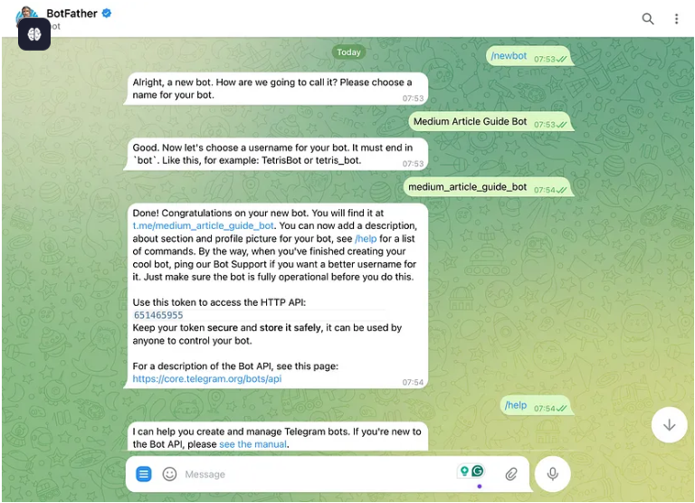
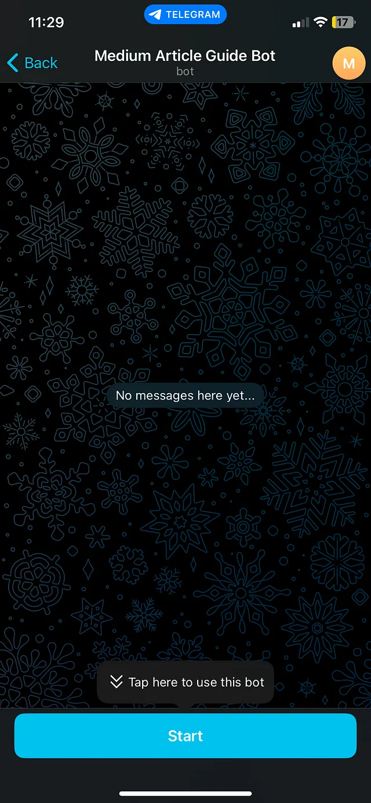
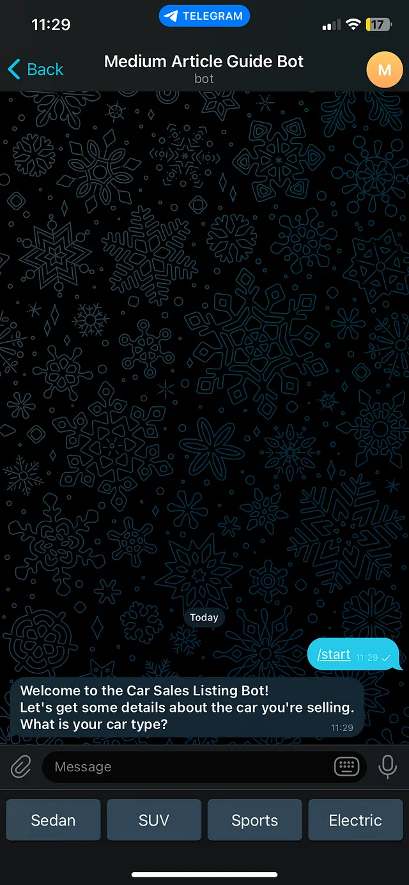
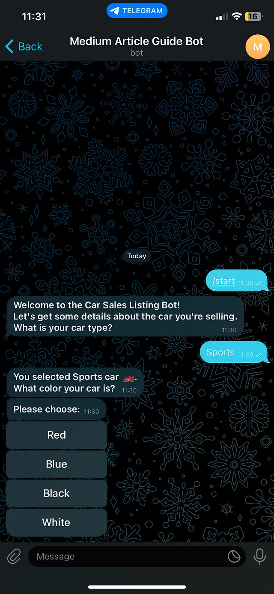
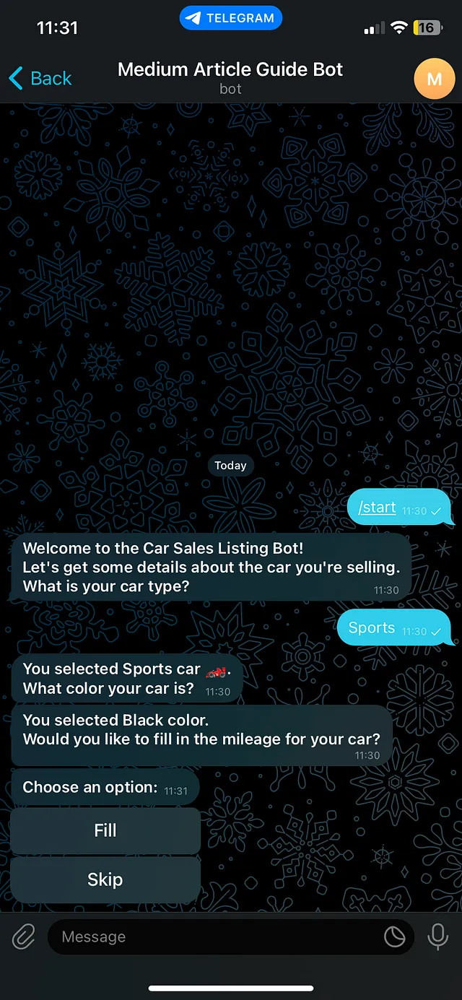
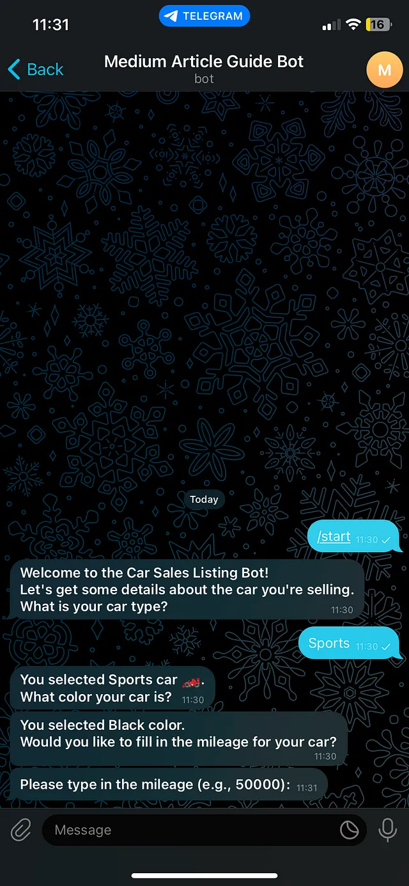
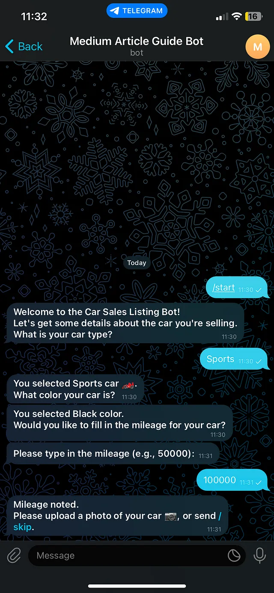
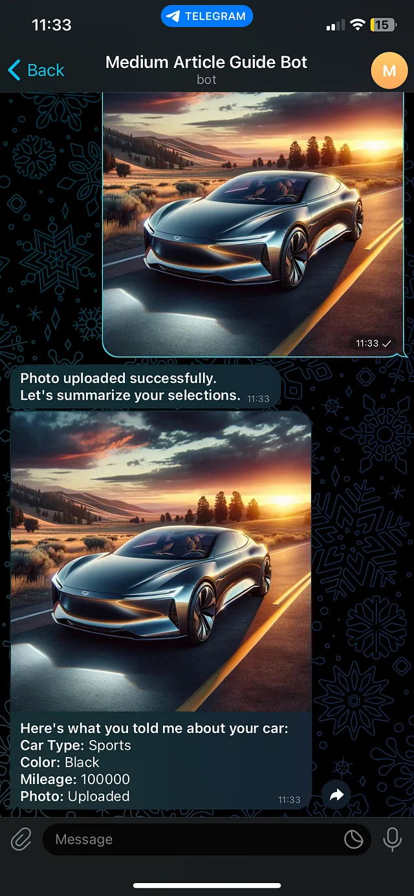

# 📦 Créer un Bot Telegram avec Python – Documentation Complète

Basée sur l’article de Moraneus : [Building Telegram Bot with Python](https://medium.com/@moraneus/building-telegram-bot-with-python-telegram-bot-a-comprehensive-guide-7e33f014dc79)

---

## 🌱 1. Préparer l’environnement

- **Créer un environnement virtuel**  
  ```bash
  python3 -m venv venv
  source venv/bin/activate
  ```

- **Installer les dépendances**  
  ```bash
  pip install -r requirements.txt
  ```

---

## 🤖 2. Créer votre bot Telegram

1. Ouvrir Telegram et rechercher **BotFather**
2. Envoyer la commande `/newbot`
3. Choisir un nom et un @username pour votre bot

4. **Copier le token** donné par BotFather 
5. Créer un fichier .env et inserer la paire clé-valeur:
```
TOKEN="7687267672:AAGHEtsFh4H8WAqCfPgL67_V48UVZugZ7eg"
```

---

## 💻 3. Écrire le code du bot

Passons maintenant au codage du bot. Veuillez créer un nouveau fichier Python, par exemple : ```my_telegram_bot``` et ouvrez-le dans votre éditeur de texte préféré. Suivez ensuite ces étapes pour créer votre bot.

### Importer des bibliothèques :

Commencez par importer les modules nécessaires et configurer la journalisation pour faciliter le débogage :

```python
import logging
from telegram import (ReplyKeyboardMarkup, ReplyKeyboardRemove, Update, InlineKeyboardButton, InlineKeyboardMarkup)
from telegram.ext import (Application, CallbackQueryHandler, CommandHandler, ContextTypes, ConversationHandler, MessageHandler, filters)

logging.basicConfig(format='%(asctime)s - %(name)s - %(levelname)s - %(message)s', level=logging.INFO)
logger = logging.getLogger(__name__)
```

### Définir les états de conversation

Les états d’un bot Telegram, notamment lorsqu’un gestionnaire de conversations est utilisé, servent de cadre pour gérer le flux d’interaction entre le bot et l’utilisateur. Il s’agit essentiellement de marqueurs ou de points de contrôle qui définissent la partie de la conversation actuellement engagée par l’utilisateur et déterminent la prochaine action du bot en fonction de ses informations.

Voici un aperçu plus général du rôle et des fonctionnalités des états dans la gestion des conversations des bots. Leurs objectifs et fonctionnalités dans le bot Telegram sont les suivants :

---

#### 1. Gestion séquentielle des flux

Les états permettent au bot de gérer un flux de conversation séquentiel. En passant d’un état à un autre, le bot peut guider l’utilisateur à travers une série d’étapes, de questions ou d’options dans un ordre logique.

---

#### 2. Connaissance du contexte

Ces informations aident le robot à maintenir le contexte d’une conversation. En connaissant l’état actuel, le robot comprend les informations fournies par l’utilisateur et celles qui sont encore nécessaires, ce qui lui permet de réagir de manière appropriée.

---

#### 3. Traitement des saisies utilisateur

Selon l’état actuel, le bot peut traiter les saisies utilisateur différemment.  
Par exemple, une saisie `<CAR_TYPE>` sera interprétée comme une indication du type de voiture à vendre, tandis qu’une saisie `<CAR_COLOR>` sera interprétée comme la couleur de la voiture.

---

#### 4. Implémentation de la logique conditionnelle

Les états permettent d’implémenter une logique conditionnelle dans la conversation.  
En fonction des réponses ou des choix de l’utilisateur, le bot peut décider d’ignorer certains états, de les répéter ou d’orienter l’utilisateur vers un autre chemin de conversation.

---

#### 5. Gestion des erreurs et répétition

Ils facilitent la gestion des erreurs et la répétition des questions si l’utilisateur fournit des réponses inexactes ou invalides.  
En suivant l’état actuel, le bot peut relancer l’utilisateur pour obtenir les informations correctes.

---

#### 6. Persistance de l’état

Dans les bots plus complexes, les états peuvent être stockés et conservés d’une session à l’autre, permettant aux utilisateurs de reprendre la conversation là où ils l’avaient laissée, même s’ils quittent temporairement le chat ou si le bot redémarre.


---

Énumérons les états pour que notre bot gère le flux :

```python
TYPE_VOITURE, COULEUR_VOITURE, DÉCISION_KILOMÉTRAGE_VOITURE, KILOMÉTRAGE_VOITURE, PHOTO, RÉSUMÉ = plage ( 6 )
```

## 🔁 4. Ajouter des fonctionnalités de conversation

Les gestionnaires de conversation des bots Telegram, notamment grâce à des bibliothèques comme `python-telegram-bot`, sont des outils puissants qui gèrent le flux des conversations en fonction des saisies utilisateur et d’états prédéfinis. Ils sont essentiels au développement de bots nécessitant une séquence d’interactions, comme la collecte d’informations, le guidage des utilisateurs dans les menus ou l’exécution de commandes dans un ordre précis.

Voici un aperçu détaillé du fonctionnement des gestionnaires de conversation et de leur rôle dans le développement de bots :

---

### Objectif et fonctionnalité

#### 1. Gestion des états conversationnels

Les gestionnaires de conversation suivent l’état actuel du dialogue avec chaque utilisateur. Ils déterminent la prochaine action du bot en fonction des informations saisies par l’utilisateur et de l’état actuel, permettant une progression fluide et logique des différentes étapes de l’interaction.

---

#### 2. Routage des entrées utilisateur

Ces entrées sont acheminées vers différentes fonctions de rappel en fonction de l’état actuel. Cela signifie qu’une même entrée peut produire des résultats différents selon la position de l’utilisateur dans la conversation.

---

#### 3. Gestion des commandes et du texte

Les gestionnaires de conversation peuvent faire la différence entre les commandes (comme `/start` ou `/help`) et les messages texte classiques, permettant aux développeurs de spécifier des réponses ou des actions distinctes pour chaque type d’entrée.

---

#### 4. Intégration avec les claviers et les boutons

Ils fonctionnent parfaitement avec les claviers personnalisés et les boutons intégrés, permettant aux développeurs de créer des interfaces interactives et conviviales au sein de la conversation.  
Les utilisateurs peuvent sélectionner des options ou naviguer parmi les fonctionnalités du bot grâce à ces éléments d’interface.

---

#### 5. Fonctions de repli et d’expiration

Les gestionnaires de conversation prennent en charge les fonctions de repli, qui peuvent être déclenchées lorsque l’utilisateur entre une entrée inattendue ou lorsque la conversation doit être réinitialisée.  
Ils peuvent également gérer les expirations, mettant fin automatiquement à une conversation après une période d’inactivité.

La mise en œuvre d’un gestionnaire de conversation implique généralement la définition de **points d’entrée**, d’**états** et de **solutions de secours** :

- **Points d’entrée** :  
  Ce sont des déclencheurs qui lancent la conversation.  
  Généralement, la commande `/start` est utilisée comme point d’entrée, mais vous pouvez définir plusieurs points d’entrée pour différents flux de conversation.

- **États** :  
  Comme indiqué précédemment, les états représentent différents points de la conversation.  
  Chaque état est associé à une ou plusieurs fonctions de rappel qui définissent le comportement du bot à ce stade.  
  Les développeurs associent les états à ces fonctions de rappel, dictant ainsi le déroulement de la conversation.

- **Fonctions de secours** :  
  Les fonctions de secours sont définies pour gérer les situations imprévues ou pour permettre de quitter ou de réinitialiser la conversation.  
  Une fonction de secours courante est une commande `/cancel` permettant aux utilisateurs d’interrompre la conversation à tout moment.

Ensuite, la fonction ```start``` de gestionnaire initie la conversation (point d'entrée), présentant à l'utilisateur une sélection de types de voitures :


```python
def  start ( update: Update, context: ContextTypes.DEFAULT_TYPE ) -> int : 
    """Démarre la conversation et demande à l'utilisateur quel est son type de voiture préféré."""
     reply_keyboard = [[ 'Berline' , 'SUV' , 'Sports' , 'Électrique' ]] 

    await update.message.reply_text( 
        '<b>Bienvenue dans le bot de vente de voitures !\n' 
        'Obtenons quelques détails sur la voiture que vous vendez.\n' 
        'Quel est votre type de voiture ?</b>' , 
        parse_mode= 'HTML' , 
        reply_markup=ReplyKeyboardMarkup(reply_keyboard, one_time_keyboard= True , resize_keyboard= True ), 
    ) 

    return CAR_TYPE
```

Vous trouverez ici le reste des gestionnaires :

```python
async  def  car_type ( update: Update, context: ContextTypes.DEFAULT_TYPE ) -> int : 
    """Enregistre le type de voiture de l'utilisateur."""
     user = update.message.from_user 
    context.user_data[ 'car_type' ] = update.message.text 
    cars = { "Berline" : "🚗" , "SUV" : "🚙" , "Sport" : "🏎️" , "Électrique" : "⚡" } 
    logger.info( 'Type de voiture de %s : %s' , user.first_name, update.message.text) 
    await update.message.reply_text( 
        f'<b>Vous avez sélectionné {update.message.text} voiture {cars[update.message.text]} .\n' 
        f'De quelle couleur est votre voiture ?</b>' , 
        parse_mode= 'HTML' , 
        reply_markup=ReplyKeyboardRemove(), 
    ) 

    # Définir des boutons en ligne pour la sélection de la couleur de la voiture
     keyboard = [ 
        [InlineKeyboardButton( 'Red' , callback_data= 'Red' )], 
        [InlineKeyboardButton( 'Blue' , callback_data= 'Blue' )], 
        [InlineKeyboardButton( 'Black' , callback_data= 'Black' )], 
        [InlineKeyboardButton( 'White' , callback_data= 'White' )], 
    ] 
    reply_markup = InlineKeyboardMarkup(keyboard) 
    await update.message.reply_text( '<b>Veuillez choisir :</b>' , parse_mode= 'HTML' , reply_markup=reply_markup) 

    return CAR_COLOR 


async  def  car_color ( update: Update, context: ContextTypes.DEFAULT_TYPE ) -> int : 
    """Enregistre la couleur de la voiture de l'utilisateur."""
     query = update.callback_query 
    await query.answer() 
    context.user_data[ 'car_color' ] = query.data 
    await query.edit_message_text( 
        text= f'<b>Vous avez sélectionné la couleur {query.data} .\n' 
             f'Souhaitez-vous renseigner le kilométrage de votre voiture ?</b>' ,
        parse_mode= 'HTML'
     ) 

    # Définir des boutons en ligne pour la décision de kilométrage
     keyboard = [ 
        [InlineKeyboardButton( 'Fill' , callback_data= 'Fill' )],
        [InlineKeyboardButton( 'Skip' , callback_data= 'Skip' )], 
    ] 
    reply_markup = InlineKeyboardMarkup(keyboard) 
    await query.message.reply_text( '<b>Choisissez une option :</b>' , parse_mode= 'HTML' , reply_markup=reply_markup) 

    return CAR_MILEAGE_DECISION 


async  def  car_mileage_decision ( update: Update, context: ContextTypes.DEFAULT_TYPE ) -> int : 
    """Demande à l'utilisateur de renseigner le kilométrage ou de l'ignorer."""
     query = update.callback_query 
    await query.answer() 
    decision = query.data 

    if decision == 'Fill' : 
        await query.edit_message_text(text= '<b>Veuillez saisir le kilométrage (par exemple, 50 000) :</b>' , parse_mode= 'HTML' ) 
        return CAR_MILEAGE 
    else : 
        await query.edit_message_text(text= '<b>Étape de kilométrage ignorée.</b>' , parse_mode= 'HTML' ) 
        return  await skip_mileage(update, context) 


async  def  car_mileage ( update: Update, context: ContextTypes.DEFAULT_TYPE ) -> int : 
    """Enregistre le kilométrage de la voiture."""
     context.user_data[ 'car_mileage' ] = update.message.text 
    await update.message.reply_text( '<b>Kilométrage noté.\n' 
                                    'Veuillez télécharger une photo de votre voiture 📷, ou envoyer /skip.</b>' , 
                                    parse_mode= 'HTML' ) 
    return PHOTO 


async  def  skip_mileage ( update: Update, context: ContextTypes.DEFAULT_TYPE ) -> int : 
    """Ignore le kilométrage input."""
     context.user_data[ 'car_mileage' ] = 'Non fourni'

     text = '<b>Veuillez télécharger une photo de votre voiture 📷, ou envoyer /skip.</b>' 

    # Déterminer la bonne façon d'envoyer une réponse en fonction du type de mise à jour 
    if update.callback_query: 
        # Si appelé à partir d'une requête de rappel, utilisez le message de la requête de rappel
         chat_id = update.callback_query.message.chat_id 
        await context.bot.send_message(chat_id=chat_id,text=text, parse_mode= 'HTML' ) 
        # En option, vous souhaiterez peut-être accuser réception de la requête de rappel 
        awaitupdate.callback_query.answer() 
    elif update.message: 
        # Si appelé depuis un message direct 
        await update.message.reply_text(text) 
    else : 
        # Gérer les autres cas ou consigner une erreur/un avertissement
         logger.warning( 'skip_mileage a été appelé sans message ni contexte de requête de rappel.' ) 

    return PHOTO 


async  def  photo ( update: Update, context: ContextTypes.DEFAULT_TYPE ) -> int : 
    """Stocke la photo."""
     photo_file = await update.message.photo[- 1 ].get_file() 
    # Stocker correctement le file_id de la photo téléchargée pour une utilisation ultérieure
     context.user_data[ 'car_photo' ] = photo_file.file_id   # Conserver cette ligne 

    # Informer l'utilisateur et passer au résumé 
    await update.message.reply_text( '<b>Photo téléchargée avec succès.\n' 
                                    'Résumons vos sélections.</b>' , 
                                    parse_mode= 'HTML'
     ) 
    await summary(update, context)   # Passer au résumé 


async  def  skip_photo ( update: Update, context: ContextTypes.DEFAULT_TYPE ) -> int : 
    """Ignore le téléchargement de la photo.""" 
    await update.message.reply_text( '<b>Aucune photo téléchargée.\n' 
                                    'Résumons vos sélections.</b>' , 
                                    parse_mode= 'HTML' ) 
    await summary(update, context) 


async  def  summary ( update: Update, context: ContextTypes.DEFAULT_TYPE ) -> int : 
    """Résume les sélections de l'utilisateur et met fin à la conversation, y compris l'image téléchargée."""
     selections = context.user_data 
    # Construire le texte du résumé
     summary_text = ( f"<b>Voici ce que vous m'avez dit à propos de votre voiture :\n</b>" 
                    f"<b>Type de voiture :</b> {selections.get( 'car_type' )} \n" 
                    f"<b>Couleur :</b> {selections.get( 'car_color' )} \n" 
                    f"<b>Kilométrage :</b> {selections.get( 'car_mileage' )} \n" 
                    f"<b>Photo :</b> { 'Téléchargé'  si  'car_photo'  dans les sélections sinon  'Non fourni' } " )

    chat_id = mise à jour.effective_chat. id 

    # Si une photo a été téléchargée, renvoyez-la avec le résumé comme légende 
    if  'car_photo'  in selections and selections[ 'car_photo' ] != 'Non fourni' : 
        await context.bot.send_photo(chat_id=chat_id, photo=selections[ 'car_photo' ], caption=summary_text, parse_mode= 'HTML' ) 
    else : 
        # Si aucune photo n'a été téléchargée, envoyez simplement le texte du résumé 
        await context.bot.send_message(chat_id=chat_id, text=summary_text, parse_mode= 'HTML' ) 

    return ConversationHandler.END 


async  def  cancel ( update: Update, context: ContextTypes.DEFAULT_TYPE ) -> int : 
    """Annule et met fin à la conversation.""" 
    await update.message.reply_text( "Au revoir ! J'espère vous parler à nouveau bientôt." , reply_markup=ReplyKeyboardRemove()) 
    renvoie ConversationHandler.END
```

### Fonction ```main``` et sondage du bot

Dans la fonction ```main```, configurez les éléments ```Application``` et ```ConversationHandler```, y compris les points d'entrée, les états et les solutions de secours. Démarrez le bot avec des interrogations pour écouter les mises à jour :

```python
def main () -> None: 
    "" "Exécutez le bot." ""
     application = Application. builder (). token ( "VOTRE JETON ICI" ). build () 

    conv_handler = ConversationHandler ( 
        entry_points=[ CommandHandler ( 'start' , start)], 
        states={ 
            CAR_TYPE : [ MessageHandler (filters.TEXT & ~filters.COMMAND, car_type)], 
            CAR_COLOR : [ CallbackQueryHandler (car_color)], 
            CAR_MILEAGE_DECISION : [ CallbackQueryHandler (car_mileage_decision)], 
            CAR_MILEAGE : [ MessageHandler (filters.TEXT & ~filters.COMMAND, car_mileage)], 
            PHOTO : [ 
                MessageHandler (filters.PHOTO, photo), 
                CommandHandler ( 'skip' , skip_photo) 
            ], 
            SUMMARY : [ MessageHandler (filters.ALL, summary)] 
        }, 
        fallbacks=[ CommandHandler ( 'cancel' , cancel)], 
    ) 

    application. add_handler (conv_handler) 

    # Gérer le cas où un utilisateur envoie /start mais qu'il n'est pas dans une conversation
     application. add_handler ( CommandHandler ( 'start' , start)) 

    application. run_polling ()
```

### Exécutez votre bot :
Complétez votre script en appelant la mainfonction. Exécutez votre bot en exécutant le script Python dans votre terminal.

Vous trouverez ici le code complet :

```python
import logging
from telegram import (ReplyKeyboardMarkup, ReplyKeyboardRemove, Update,
                      InlineKeyboardButton, InlineKeyboardMarkup)
from telegram.ext import (Application, CallbackQueryHandler, CommandHandler,
                          ContextTypes, ConversationHandler, MessageHandler, filters)

# Enable logging
logging.basicConfig(format='%(asctime)s - %(name)s - %(levelname)s - %(message)s',
                    level=logging.INFO)

logger = logging.getLogger(__name__)

# Define states
CAR_TYPE, CAR_COLOR, CAR_MILEAGE_DECISION, CAR_MILEAGE, PHOTO, SUMMARY = range(6)


async def start(update: Update, context: ContextTypes.DEFAULT_TYPE) -> int:
    """Starts the conversation and asks the user about their preferred car type."""
    reply_keyboard = [['Sedan', 'SUV', 'Sports', 'Electric']]

    await update.message.reply_text(
        '<b>Welcome to the Car Sales Listing Bot!\n'
        'Let\'s get some details about the car you\'re selling.\n'
        'What is your car type?</b>',
        parse_mode='HTML',
        reply_markup=ReplyKeyboardMarkup(reply_keyboard, one_time_keyboard=True, resize_keyboard=True),
    )

    return CAR_TYPE


async def car_type(update: Update, context: ContextTypes.DEFAULT_TYPE) -> int:
    """Stores the user's car type."""
    user = update.message.from_user
    context.user_data['car_type'] = update.message.text
    cars = {"Sedan": "🚗", "SUV": "🚙", "Sports": "🏎️", "Electric": "⚡"}
    logger.info('Car type of %s: %s', user.first_name, update.message.text)
    await update.message.reply_text(
        f'<b>You selected {update.message.text} car {cars[update.message.text]}.\n'
        f'What color your car is?</b>',
        parse_mode='HTML',
        reply_markup=ReplyKeyboardRemove(),
    )

    # Define inline buttons for car color selection
    keyboard = [
        [InlineKeyboardButton('Red', callback_data='Red')],
        [InlineKeyboardButton('Blue', callback_data='Blue')],
        [InlineKeyboardButton('Black', callback_data='Black')],
        [InlineKeyboardButton('White', callback_data='White')],
    ]
    reply_markup = InlineKeyboardMarkup(keyboard)
    await update.message.reply_text('<b>Please choose:</b>', parse_mode='HTML', reply_markup=reply_markup)

    return CAR_COLOR


async def car_color(update: Update, context: ContextTypes.DEFAULT_TYPE) -> int:
    """Stores the user's car color."""
    query = update.callback_query
    await query.answer()
    context.user_data['car_color'] = query.data
    await query.edit_message_text(
        text=f'<b>You selected {query.data} color.\n'
             f'Would you like to fill in the mileage for your car?</b>',
        parse_mode='HTML'
    )

    # Define inline buttons for mileage decision
    keyboard = [
        [InlineKeyboardButton('Fill', callback_data='Fill')],
        [InlineKeyboardButton('Skip', callback_data='Skip')],
    ]
    reply_markup = InlineKeyboardMarkup(keyboard)
    await query.message.reply_text('<b>Choose an option:</b>', parse_mode='HTML', reply_markup=reply_markup)

    return CAR_MILEAGE_DECISION


async def car_mileage_decision(update: Update, context: ContextTypes.DEFAULT_TYPE) -> int:
    """Asks the user to fill in the mileage or skip."""
    query = update.callback_query
    await query.answer()
    decision = query.data

    if decision == 'Fill':
        await query.edit_message_text(text='<b>Please type in the mileage (e.g., 50000):</b>', parse_mode='HTML')
        return CAR_MILEAGE
    else:
        await query.edit_message_text(text='<b>Mileage step skipped.</b>', parse_mode='HTML')
        return await skip_mileage(update, context)


async def car_mileage(update: Update, context: ContextTypes.DEFAULT_TYPE) -> int:
    """Stores the car mileage."""
    context.user_data['car_mileage'] = update.message.text
    await update.message.reply_text('<b>Mileage noted.\n'
                                    'Please upload a photo of your car 📷, or send /skip.</b>',
                                    parse_mode='HTML')
    return PHOTO


async def skip_mileage(update: Update, context: ContextTypes.DEFAULT_TYPE) -> int:
    """Skips the mileage input."""
    context.user_data['car_mileage'] = 'Not provided'

    text = '<b>Please upload a photo of your car 📷, or send /skip.</b>'

    # Determine the correct way to send a reply based on the update type
    if update.callback_query:
        # If called from a callback query, use the callback_query's message
        chat_id = update.callback_query.message.chat_id
        await context.bot.send_message(chat_id=chat_id, text=text, parse_mode='HTML')
        # Optionally, you might want to acknowledge the callback query
        await update.callback_query.answer()
    elif update.message:
        # If called from a direct message
        await update.message.reply_text(text)
    else:
        # Handle other cases or log an error/warning
        logger.warning('skip_mileage was called without a message or callback_query context.')

    return PHOTO


async def photo(update: Update, context: ContextTypes.DEFAULT_TYPE) -> int:
    """Stores the photo."""
    photo_file = await update.message.photo[-1].get_file()
    # Correctly store the file_id of the uploaded photo for later use
    context.user_data['car_photo'] = photo_file.file_id  # Preserve this line

    # Inform user and transition to summary
    await update.message.reply_text('<b>Photo uploaded successfully.\n'
                                    'Let\'s summarize your selections.</b>',
                                    parse_mode='HTML'
    )
    await summary(update, context)  # Proceed to summary


async def skip_photo(update: Update, context: ContextTypes.DEFAULT_TYPE) -> int:
    """Skips the photo upload."""
    await update.message.reply_text('<b>No photo uploaded.\n'
                                    'Let\'s summarize your selections.</b>',
                                    parse_mode='HTML')
    await summary(update, context)


async def summary(update: Update, context: ContextTypes.DEFAULT_TYPE) -> int:
    """Summarizes the user's selections and ends the conversation, including the uploaded image."""
    selections = context.user_data
    # Construct the summary text
    summary_text = (f"<b>Here's what you told me about your car:\n</b>"
                    f"<b>Car Type:</b> {selections.get('car_type')}\n"
                    f"<b>Color:</b> {selections.get('car_color')}\n"
                    f"<b>Mileage:</b> {selections.get('car_mileage')}\n"
                    f"<b>Photo:</b> {'Uploaded' if 'car_photo' in selections else 'Not provided'}")

    chat_id = update.effective_chat.id

    # If a photo was uploaded, send it back with the summary as the caption
    if 'car_photo' in selections and selections['car_photo'] != 'Not provided':
        await context.bot.send_photo(chat_id=chat_id, photo=selections['car_photo'], caption=summary_text, parse_mode='HTML')
    else:
        # If no photo was uploaded, just send the summary text
        await context.bot.send_message(chat_id=chat_id, text=summary_text, parse_mode='HTML')

    return ConversationHandler.END


async def cancel(update: Update, context: ContextTypes.DEFAULT_TYPE) -> int:
    """Cancels and ends the conversation."""
    await update.message.reply_text('Bye! Hope to talk to you again soon.', reply_markup=ReplyKeyboardRemove())
    return ConversationHandler.END


def main() -> None:
    """Run the bot."""
    application = Application.builder().token("YOUR TOKEN HERE").build()

    conv_handler = ConversationHandler(
        entry_points=[CommandHandler('start', start)],
        states={
            CAR_TYPE: [MessageHandler(filters.TEXT & ~filters.COMMAND, car_type)],
            CAR_COLOR: [CallbackQueryHandler(car_color)],
            CAR_MILEAGE_DECISION: [CallbackQueryHandler(car_mileage_decision)],
            CAR_MILEAGE: [MessageHandler(filters.TEXT & ~filters.COMMAND, car_mileage)],
            PHOTO: [
                MessageHandler(filters.PHOTO, photo),
                CommandHandler('skip', skip_photo)
            ],
            SUMMARY: [MessageHandler(filters.ALL, summary)]
        },
        fallbacks=[CommandHandler('cancel', cancel)],
    )

    application.add_handler(conv_handler)

    # Handle the case when a user sends /start but they're not in a conversation
    application.add_handler(CommandHandler('start', start))

    application.run_polling()


if __name__ == '__main__':
    main()
```

---

## ▶️ 5. Lancer le bot

Après avoir exécuté votre script, recherchez votre bot sur Telegram et commencez à interagir avec lui. Vous devriez maintenant pouvoir utiliser la commande ```/start``` pour démarrer une conversation, qui vous guidera tout au long de la mise en vente d'une voiture.

| | | |
|:---:|:---:|:---:|
|  |  |  |  |
|  |  |  |  |

# Conclusion:

Vous pouvez étendre votre bot Telegram pour y inclure la gestion des SMS et des boutons interactifs, le rendant ainsi beaucoup plus attrayant. Ce n'est qu'un aperçu des possibilités offertes par la bibliothèque ```python-telegram-bot```. En explorant plus en profondeur, vous découvrirez des options pour gérer différents types de contenu, intégrer des API externes et bien plus encore. Plongez dans la documentation de la bibliothèque pour découvrir toutes les possibilités de votre nouveau bot Telegram.

Bon codage et amusez-vous à donner vie à votre bot Telegram !

---